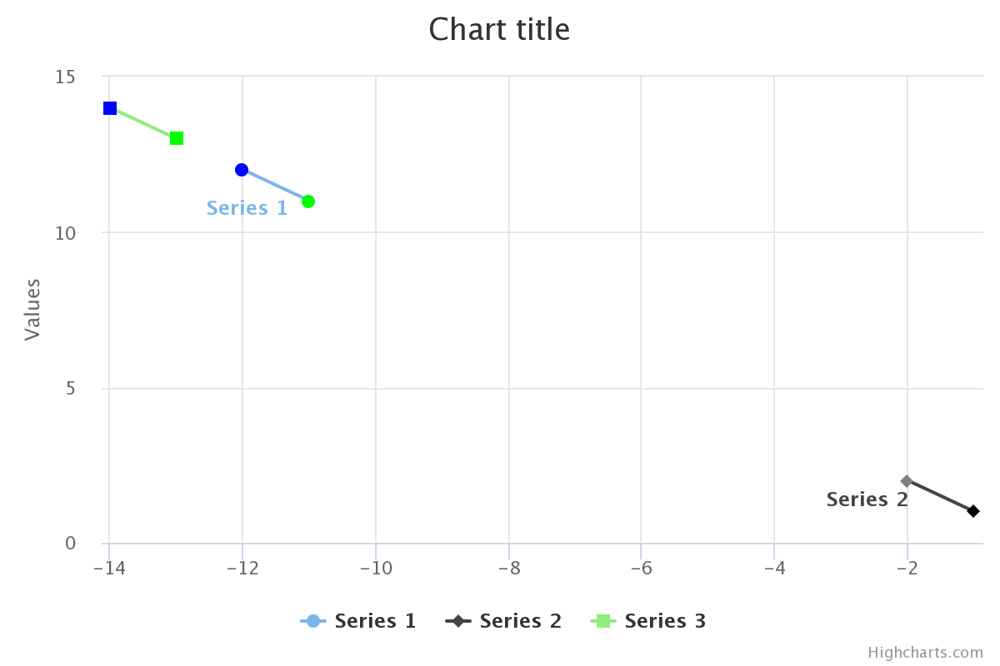

# `Nested` - проверка вложенных и связанных данных

## Базовое использование (связь "один к одному")

Во многих случаях необходимо проверять связанные данные в дополнение к
текущей сущности/модели. Для этой цели существует правило `Nested`.

```php
use Yiisoft\Validator\Rule\Length;
use Yiisoft\Validator\Rule\Nested;
use Yiisoft\Validator\Rule\Number;
use Yiisoft\Validator\Rule\Required;
use Yiisoft\Validator\Validator;

$data = ['author' => ['name' => 'John', 'age' => '17']];
$rule = new Nested([
    'title' => [new Required()],
    'author' => new Nested([
        'name' => [new Length(min: 3)],
        'age' => [new Number(min: 18)],
    ]),
]);
$errors = (new Validator())->validate($data, $rule)->getErrorMessagesIndexedByPath();
```

Вывод `$errors` будет такой:

```php
[
    'title' => ['Value cannot be blank.'], 
    'author.age' => ['Value must be no less than 18.'],
];
```
В этом примере для каждого отношения используется дополнительный экземпляр
правила `Nested`. Возможны и другие варианты настройки, описанные ниже.

Другие представления списка ошибок рассматриваются в разделе [Результат].

## Параметры конфигурации

### Нотация "через точку"

В качестве альтернативного метода конфигурирования можно использовать
нотацию через точку. В этом случае приведенный выше пример будет выглядеть
следующим образом:

```php
use Yiisoft\Validator\Rule\Length;
use Yiisoft\Validator\Rule\Nested;
use Yiisoft\Validator\Rule\Number;
use Yiisoft\Validator\Rule\Required;

$rule = new Nested([
    'title' => [new Required()],
    'author.name' => [new Length(min: 3)],
    'author.age' => [new Number(min: 18)],
]);
```

Также возможно объединить оба подхода:

```php
use Yiisoft\Validator\Rule\Length;
use Yiisoft\Validator\Rule\Nested;
use Yiisoft\Validator\Rule\Number;
use Yiisoft\Validator\Rule\Required;

$data = ['author' => ['name' => 'Alexey', 'age' => '31']];
$rule = new Nested([
    'content' => new Nested([
        'title' => [new Required()],
        'description' => [new Required()],
    ]),
    'author.name' => [new Length(min: 3)],
    'author.age' => [new Number(min: 18)],
]);]
```

### Пропуск кода

Для краткости часть кода можно опустить.

#### Внутренние экземпляры `Nested`

Внутренние экземпляры `Nested` могут быть опущены:

```php
use Yiisoft\Validator\Rule\Length;
use Yiisoft\Validator\Rule\Nested;

$rule = new Nested([
    'author' => [
        'name' => [new Length(min: 1)],
    ],
]);
```

#### Внутренние массивы для отдельных правил

Внутренние массивы для отдельных правил могут быть опущены независимо от
уровня вложенности:

```php
use Yiisoft\Validator\Rule\Length;
use Yiisoft\Validator\Rule\Nested;

$rule = new Nested([
    'author' => [
        'name' => [
            'surname' => new Length(min: 1),
        ],
    ],
]);
```

## Расширенное использование

### Отношения "один ко многим" и "многие ко многим"

Пример в разделе [ Базовое использование] показывает, как работать только с
отношениями "один к одному", где правила `Nested` достаточно для ссылки на
отношения. Его можно комбинировать с другими сложными правилами, такими как
`Each`, для проверки отношений "один ко многим" и "многие ко многим":

Давайте возьмем в качестве примера этот набор линейных диаграмм:

```php
$data = [
    'charts' => [
        [
            'points' => [
                ['coordinates' => ['x' => -11, 'y' => 11], 'rgb' => [1, 255, 0]],
                ['coordinates' => ['x' => -12, 'y' => 12], 'rgb' => [0, 2, 255]],
            ],
        ],
        [
            'points' => [
                ['coordinates' => ['x' => -1, 'y' => 1], 'rgb' => [0, 0, 0]],
                ['coordinates' => ['x' => -2, 'y' => 2], 'rgb' => [128, 128, 128]],
            ],
        ],
        [
            'points' => [
                ['coordinates' => ['x' => -13, 'y' => 13], 'rgb' => [3, 255, 0]],
                ['coordinates' => ['x' => -14, 'y' => 14], 'rgb' => [0, 4, 255]],
            ],
        ],
    ],
];
```

Визуальное представление может выглядеть так (также доступно на [JSFiddle]):



Давайте добавим правила и немного изменим данные, чтобы они содержали
недопустимые элементы:

```php
use Yiisoft\Validator\Rule\Count;
use Yiisoft\Validator\Rule\Each;
use Yiisoft\Validator\Rule\Nested;
use Yiisoft\Validator\Rule\Number;
use Yiisoft\Validator\Validator;

$data = [
    'charts' => [
        [
            'points' => [
                ['coordinates' => ['x' => -11, 'y' => 11], 'rgb' => [-1, 256, 0]],
                ['coordinates' => ['x' => -12, 'y' => 12], 'rgb' => [0, -2, 257]],
            ],
        ],
        [
            'points' => [
                ['coordinates' => ['x' => -1, 'y' => 1], 'rgb' => [0, 0, 0]],
                ['coordinates' => ['x' => -2, 'y' => 2], 'rgb' => [255, 255, 255]],
            ],
        ],
        [
            'points' => [
                ['coordinates' => ['x' => -13, 'y' => 13], 'rgb' => [-3, 258, 0]],
                ['coordinates' => ['x' => -14, 'y' => 14], 'rgb' => [0, -4, 259]],
            ],
        ],
    ],
];
$rule = new Nested([
    'charts' => new Each([
        new Nested([
            'points' => new Each([
                new Nested([
                    'coordinates' => new Nested([
                        'x' => [new Number(min: -10, max: 10)],
                        'y' => [new Number(min: -10, max: 10)],
                    ]),
                    'rgb' => new Each([
                        new Count(3),
                        new Number(min: 0, max: 255),
                    ]),
                ]),
            ]),
        ]),
    ]),
]);
$result = (new Validator())->validate($data, $rule);
$errors = $result->getErrorMessagesIndexedByPath();
```

Содержание `$errors` будет следующим:

```php
$errors = [
    'charts.0.points.0.coordinates.x' => ['Value must be no less than -10.'],
    // ...
    'charts.0.points.0.rgb.0' => ['Value must be no less than 0. -1 given.'],
    // ...
];
```

### Использование сокращения `*`

Для упрощения комбинаций `Nested` и `Each` можно использовать сокращение
`*`:

```php
use Yiisoft\Validator\Rule\Count;
use Yiisoft\Validator\Rule\Nested;
use Yiisoft\Validator\Rule\Number;

$rule = new Nested([
    'charts.*.points.*.coordinates.x' => [new Number(min: -10, max: 10)],
    'charts.*.points.*.coordinates.y' => [new Number(min: -10, max: 10)],
    'charts.*.points.*.rgb' => [
        new Count(3),
        new Number(min: 0, max: 255),
    ],
]);
```

С дополнительной группировкой это можно переписать так:

```php
use Yiisoft\Validator\Rule\Count;
use Yiisoft\Validator\Rule\Nested;
use Yiisoft\Validator\Rule\Number;

$rule = new Nested([
    'charts.*.points.*.coordinates' => new Nested([
        'x' => [new Number(min: -10, max: 10)],
        'y' => [new Number(min: -10, max: 10)],
    ]),
    'charts.*.points.*.rgb' => [
        new Count(3),
        new Number(min: 0, max: 255),
    ],
]);
```

Это менее многословно, но недостаток такого подхода заключается в том, что
вы не можете дополнительно настроить динамически генерируемые пары `Nested`
и `Each`. Если вам это необходимо, используйте явную форму конфигурации
(см. пример в разделе [Базовое использование]).

### Использование атрибутов

Правила и отношения можно объявлять через DTO с PHP атрибутами:

```php
use Yiisoft\Validator\Rule\Count;
use Yiisoft\Validator\Rule\Each;
use Yiisoft\Validator\Rule\Nested;
use Yiisoft\Validator\Rule\Number;

final class ChartSet
{
    public function __construct(
        #[Each([new Nested(Chart::class)])]
        private array $charts,
    ) {
    }
}

final class Chart
{
    public function __construct(
        #[Each([new Nested(Point::class)])]
        private array $points,
    ) {
    }
}

final class Point
{
    public function __construct(
        #[Nested(Coordinates::class)]
        private Coordinates $coordinates,
        #[Count(exactly: 3)]
        #[Each([new Number(min: 0, max: 255)])]
        private array $rgb,
    ) {
    }
}

final class Coordinates
{
    public function __construct(
        #[Number(min: -10, max: 10)]
        private int $x,
        #[Number(min: -10, max: 10)]
        private int $y,
    ) {
    }
}
```

Имея данные в ассоциативном массиве из предыдущих примеров, мы можем
использовать класс только для извлечения правил:

```php
$data = [
    'charts' => [
        [
            'points' => [
                ['coordinates' => ['x' => -11, 'y' => 11], 'rgb' => [-1, 256, 0]],
                ['coordinates' => ['x' => -12, 'y' => 12], 'rgb' => [0, -2, 257]],
            ],
        ],
        [
            'points' => [
                ['coordinates' => ['x' => -1, 'y' => 1], 'rgb' => [0, 0, 0]],
                ['coordinates' => ['x' => -2, 'y' => 2], 'rgb' => [255, 255, 255]],
            ],
        ],
        [
            'points' => [
                ['coordinates' => ['x' => -13, 'y' => 13], 'rgb' => [-3, 258, 0]],
                ['coordinates' => ['x' => -14, 'y' => 14], 'rgb' => [0, -4, 259]],
            ],
        ],
    ],
];
$result = $validator->validate($data, ChartSet::class);
```

Или предоставьте данные вместе с правилами в тех же объектах:

```php
$chartSet = new ChartSet(
    charts: [
        new Chart(
            points: [
                new Point(
                    coordinates: new Coordinates(x: -11, y: 11),
                    rgb: [-1, 256, 0],
                ),
                new Point(
                    coordinates: new Coordinates(x: -12, y: 12),
                    rgb: [0, -2, 257],
                ),
            ],       
        ),
        new Chart(
            points: [
                new Point(
                    coordinates: new Coordinates(x: -1, y: 1),
                    rgb: [0, 0, 0],
                ),
                new Point(
                    coordinates: new Coordinates(x: -2, y: 2),
                    rgb: [255, 255, 255],
                ),
            ],       
        ),
        new Chart(
            points: [
                new Point(
                    coordinates: new Coordinates(x: -13, y: 13),
                    rgb: [-3, 258, 0],
                ),
                new Point(
                    coordinates: new Coordinates(x: -14, y: 14),
                    rgb: [0, -4, 259],
                ),
            ],       
        ),
    ],
);
$result = $validator->validate($chartSet); // Обратите внимание, что аргумент `$rules` здесь равен `null`.
$errors = $result->getErrorMessagesIndexedByPath();
```

- Дополнительную информацию о различных способах настройки правил с помощью
атрибутов PHP см. в разделе [Настройка правил с помощью PHP атрибутов]. -
Дополнительную информацию о возможных комбинациях данных/правил,
передаваемых для проверки, см. в разделе [Использование валидатора].

### Использование ключей, содержащих разделитель/сокращение

Если ключ содержит разделитель (`.`) или сокращение `Each` (`*`) для
корректной работы его необходимо экранировать обратной косой чертой (`\`) в
конфигурации правила. Во входных данных экранирование не требуется. Вот
пример с двумя вложенными ключами с именами `author.data` и `name.surname`:

```php
use Yiisoft\Validator\Rule\Length;
use Yiisoft\Validator\Rule\Nested;

$rule = new Nested([
    'author\.data.name\.surname' => [
        new Length(min: 3),
    ],
]);
$data = [
    'author.data' => [
        'name.surname' => 'Dmitry',
    ],
];
```

Обратите внимание, что при использовании нескольких вложенных правил для
конфигурации экранирование по-прежнему необходимо:

```php
use Yiisoft\Validator\Rule\Length;
use Yiisoft\Validator\Rule\Nested;

$rule = new Nested([
    'author\.data' => new Nested([
        'name\.surname' => [
            new Length(min: 3),
        ],
    ]),
]);
$data = [
    'author.data' => [
        'name.surname' => 'Dmitriy',
    ],
];
```

Пример с сокращением `*`:

```php
use Yiisoft\Validator\Rule\Nested;

$rule = new Nested([
    'charts\.list.*.points\*list.*.coordinates\.data.x' => [
        // ...
    ],
    'charts\.list.*.points\*list.*.coordinates\.data.y' => [
        // ...
    ],
    'charts\.list.*.points\*list.*.rgb' => [
        // ...
    ],
]);
$data = [
    'charts.list' => [
        [
            'points*list' => [
                [
                    'coordinates.data' => ['x' => -11, 'y' => 11], 'rgb' => [-1, 256, 0],
                ],
            ],
        ],
    ],
];
```

[Результаты]: result.md
[Базовое использование]: #базовое-использование-связь-один-к-одному
[JSFiddle]: https://jsfiddle.net/fys8uadr/
[Настройка правил с помощью PHP атрибутов]: configuring-rules-via-php-attributes.md
[Использование валидатора]: using-validator.md
